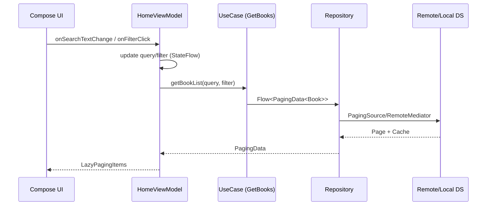

## 카카오 도서 검색 (Kakao Book Search)

> 클린 아키텍처와 MVVM을 기반으로, RemoteMediator로 원격/로컬 데이터를 동기화하고, build-logic으로 Gradle 중복을 제거한 안드로이드 프로젝트입니다.

- **아키텍처**: Clean Architecture + MVVM
- **페이징/동기화**: Paging 3 + RemoteMediator + 캐시 동기화
- **빌드 시스템**: Gradle Version Catalog + custom build-logic 플러그인
- **디자인 시스템**: 재사용 가능한 컴포넌트(Buttons, Cards, Text 등)

---

### 목차
- [프로젝트 특징](#프로젝트-특징)
- [아키텍처](#아키텍처)
  - [Clean Architecture 레이어링](#clean-architecture-레이어링)
  - [MVVM 데이터 흐름](#mvvm-데이터-흐름)
- [데이터 동기화: RemoteMediator](#데이터-동기화-remotemediator)
- [모듈 구조](#모듈-구조)
- [빌드 로직: build-logic](#빌드-로직-build-logic)
- [디자인 시스템](#디자인-시스템)
- [실행 방법](#실행-방법)
- [기술 스택](#기술-스택)

---

### 프로젝트 특징
- **유지보수성 증가**: 도메인/데이터/프레젠테이션을 분리하고, 의존성의 방향을 도메인에 수렴시켜 변경 영향 범위를 최소화했습니다.
- **확장 용이**: 모듈 경계를 통해 기능 추가/수정 시 영향도를 국소화하고, 공통은 `core`로 재사용합니다.
- **네트워크 회복력**: RemoteMediator로 서버/로컬 간 일관된 페이징과 캐시를 제공하여 오프라인에서도 유연합니다.
- **일관된 UI**: 디자인 시스템으로 컴포넌트 재사용을 극대화하여 개발 속도와 일관성을 확보했습니다.
- **빌드 효율화**: `build-logic` 커스텀 플러그인으로 중복 Gradle 설정 제거 및 일관성 제공.

---

### 아키텍처

#### Clean Architecture 레이어링
```mermaid
flowchart LR
    UI[Feature (home/detail/main)] -->|usecases| DOMAIN[Domain]
    DOMAIN -->|contracts| REPO[Repository Interface]
    DATA[Data (repository/datasource)] -->|implements| REPO
    DATA --> REMOTE[Remote]
    DATA --> LOCAL[Local]

    classDef layer fill:#f0f7ff,stroke:#5b9bd5,stroke-width:1px;
    classDef domain fill:#f6ffed,stroke:#52c41a,stroke-width:1px;
    classDef data fill:#fff7e6,stroke:#fa8c16,stroke-width:1px;
    class UI layer
    class DOMAIN domain
    class DATA,REMOTE,LOCAL data
```
- `domain`: 엔티티/유즈케이스/리포지토리 계약. 외부에 의존하지 않음.
- `data`: `repository`가 `datasource(remote/local)`를 조합해 계약을 구현.
- `feature`: 화면/상태/UI 모델. 도메인에만 의존.
- `core`: 디자인 시스템, 공용 유틸/컴포넌트.

#### MVVM 데이터 흐름

- 입력 변화는 `flatMapLatest`로 기존 스트림을 취소하고 새 페이징을 시작합니다.
- UI는 `LazyPagingItems`로 로딩/에러/빈 상태를 선언적으로 처리합니다.

---

### 데이터 동기화: RemoteMediator
원격(카카오 API)에서 가져온 데이터를 **로컬 DB에 캐시**하고, 페이징 경계에서 동기화를 수행합니다.

```mermaid
flowchart TB
    TRIGGER[User scroll / refresh] --> MEDIATOR[RemoteMediator]
    MEDIATOR -->|load()| REMOTE[(Remote API)]
    MEDIATOR -->|cache| DB[(Local DB)]
    UI[Compose Paging] -->|PagingSource from DB| DB
    DB --> UI

    classDef node fill:#eef,stroke:#99f,stroke-width:1px;
    class TRIGGER,MEDIATOR,REMOTE,DB,UI node
```
- 최초/추가 페이지 로드 시 원격 호출 → 결과를 로컬 DB 저장 → UI는 DB 기반 `PagingSource`로 그리며, 네트워크 상태와 무관하게 스크롤 경험을 제공합니다.
- 캐시 무효화/갱신 전략은 페이징 키/메타와 함께 관리합니다.

> 본 저장소에는 RemoteMediator 기반 구현을 적용해, 서버/로컬 간 **일관된 단일 데이터 소스**를 보장합니다.

---

### 모듈 구조
```
kakao-book-search/
  app/                 # Application 엔트리
  core/                # 디자인 시스템, 공용 컴포넌트
  domain/              # 엔티티/유즈케이스/리포지토리 계약
  data/
    datasource/        # Remote/Local 데이터소스 + DI 모듈
    repository/        # Repository 구현 + PagingSource/RemoteMediator
  feature/
    main/              # Navigation, Theme
    home/              # 검색/필터/페이징 화면
    detail/            # 상세 화면
  build-logic/         # 커스텀 Gradle 플러그인
```

---

### 빌드 로직: build-logic
- 프로젝트 전역의 **중복 Gradle 설정을 제거**하기 위해 `build-logic` 모듈의 커스텀 플러그인을 사용합니다.
- 예) `ApplicationPlugin`, `FeaturePlugin`, `DataPlugin`, `DomainPlugin`, `HiltPlugin`, `ComposeProject` 등으로 공통 설정(의존성/컴파일 옵션/Compose/Hilt 등)을 중앙집중화.
- 버전 관리: `gradle/libs.versions.toml` 기반 Version Catalog로 라이브러리/플러그인 버전을 일관되게 관리합니다.

효과
- 모듈 추가 시 간단한 플러그인 적용만으로 표준 설정 자동화
- 설정 분산으로 인한 drift 방지, **빌드 일관성** 확보

---

### 디자인 시스템
- `core/design`에 버튼, 카드, 배지, 타이포그래피, 서치바 등 **재사용 가능한 UI 컴포넌트**를 제공합니다.
- 공통 인터랙션/스타일 가이드로 **일관된 UX**와 **개발 생산성** 향상.

예)
- `BHorizontalCard`, `BVerticalCard`, `BIconButton`, `BSearchBar`, `BTextView`, `Skeleton` 등

---

### 실행 방법
1) 로컬 환경
- Android Studio 최신 버전에서 열기
- JDK 17 이상 권장
- `gradlew assembleDebug` 또는 IDE에서 Run

2) 환경 변수/키
- 카카오 API 키 등 네트워크 키가 필요할 수 있습니다. 로컬 `local.properties` 혹은 안전한 주입 방식을 사용하세요.

3) 모듈 플러그인 적용
- 각 모듈의 `build.gradle.kts`에 `build-logic` 플러그인을 적용하도록 구성되어 있습니다. 별도 설정 없이 빌드 가능합니다.

---

### 기술 스택
- 언어: Kotlin, Coroutines/Flow
- DI: Hilt
- UI: Jetpack Compose
- 아키텍처: Clean Architecture, MVVM
- 데이터: Paging 3, RemoteMediator, Room(또는 유사 로컬 저장소), Retrofit/OkHttp
- 빌드: Gradle Version Catalog, Custom build-logic Plugins

---

### 스크린샷/데모 (선택)
- 홈: 검색/필터/페이징
- 상세: 도서 상세 및 액션

> 이 문서는 유지보수를 위해 주기적으로 업데이트됩니다. 개선 제안은 환영합니다!
